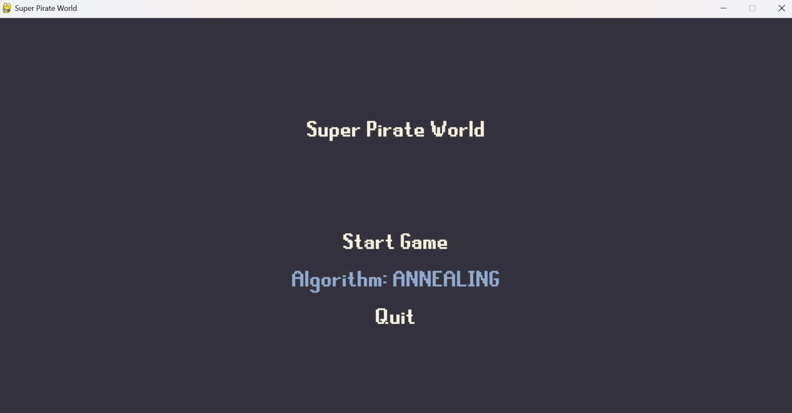
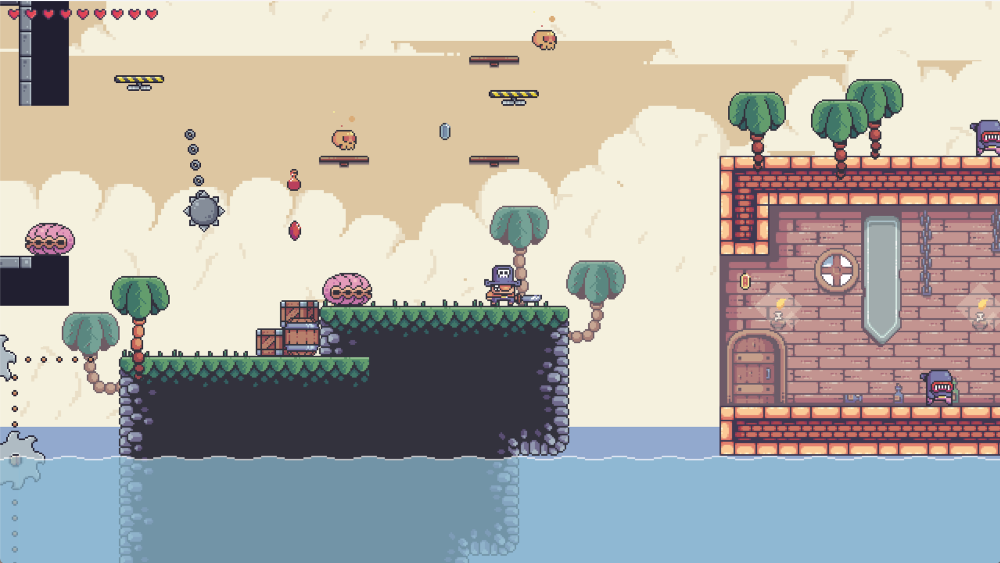
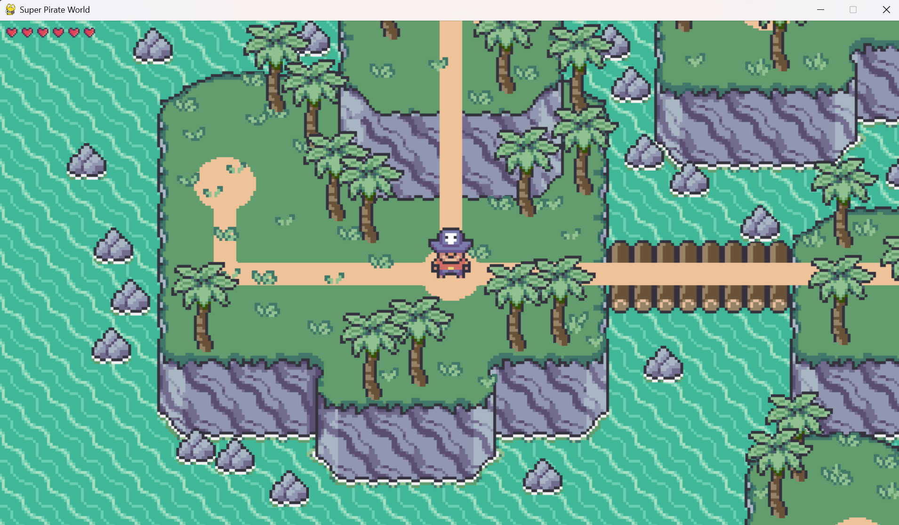

# 🏴‍☠️ Game Thế Giới Hải Tặc


Đây là một **game đi cảnh 2D** được xây dựng bằng **Python + Pygame**, nơi người chơi điều khiển nhân vật chính vượt qua các chướng ngại vật. Game tích hợp nhiều **thuật toán AI** để điều khiển kẻ địch (`Tooth`) và (`Shell`) nhằm truy đuổi hoặc tấn công người chơi một cách thông minh.

---

## 🎮 Gameplay

- Người chơi bắt đầu từ bên trái màn hình và di chuyển đến vị trí cây cờ để hoàn thành màn chơi.
- Kẻ địch (`Tooth`) sẽ đuổi theo người chơi, còn (`Shell`) sẽ bắn các viên đạn (`Pearl`) bằng các thuật toán tìm đường.
- Các thuật toán AI có thể thay đổi linh hoạt để người chơi thử nghiệm hiệu quả.

---

## 🧠 Thuật toán AI sử dụng cho Enemy (`Tooth`) và (`Shell`):

### 🔎 Nhóm 1: Tìm kiếm không có thông tin (Uninformed Search)
- **DFS** – Depth-First Search  
- **BFS** – Breadth-First Search

### 💡 Nhóm 2: Tìm kiếm có thông tin (Informed Search)
- **A\*** – A-star Search

### 🧗‍♂️ Nhóm 3: Tìm kiếm cục bộ (Local Search)
- **Steepest Ascent Hill Climbing**  
- **Simulated Annealing**  
- **Beam Search**

### 🔗 Nhóm 4: Tìm kiếm có ràng buộc (Constraint Search)
- **Backtracking**

### ❓ Nhóm 5: Môi trường không xác định (Nondeterministic Search)
- **No Observation Search**

### 🧠 Nhóm 6: Học tăng cường (Reinforcement Learning)
- **Q-Learning**

---

## 🖼️ Giao diện phần mềm

### 🧭 Menu chọn thuật toán


### 🕹️ Màn hình chơi chính


### 🗺️ Giao diện chọn bản đồ


---

## 🛠️ Hướng dẫn cài đặt

### 1. Cài đặt Python
Tải Python 3.8+ tại: [https://www.python.org/downloads](https://www.python.org/downloads)

### 2. Cài đặt thư viện
```bash
pip install pygame pytmx numpy

#Dự án được tham khảo từ: https://youtu.be/WViyCAa6yLI?si=Fnoexm3ta6dEJhD-
