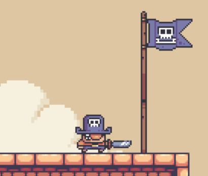

# Game thế giới hải tặc

Đây là một **game đi cảnh 2D** được xây dựng bằng **Python + Pygame**, nơi người chơi điều khiển nhân vật chính vượt qua các chướng ngại vật. Game tích hợp nhiều **thuật toán AI** để điều khiển kẻ địch (`Tooth`)  nhằm truy đuổi người chơi một cách thông minh.

## 🎮 Gameplay

- Người chơi bắt đầu từ bên trái màn hình và di chuyển đến vị trí cây cờ để hoàn thành màn chơi.
- Enemy (`Tooth`) sẽ đuổi theo người chơi và Enemy (`Shell`) sẽ bắn các viên đạn pearl về phía người chơi bằng các thuật toán tìm đường.
- Các thuật toán có thể thay đổi trong lúc chơi để thử nghiệm hiệu quả.

## 🧠 Thuật toán AI sử dụng cho Enemy (`Tooth`) và Pearl:
### 🔎 Nhóm 1: Tìm kiếm không có thông tin (Uninformed Search)
- **DFS** – Depth-First Search
- **BFS** – Breadth-First Search

### 💡 Nhóm 2: Tìm kiếm có thông tin (Informed Search)
- **A\*** – A-star Search

### 🧗‍♂️ Nhóm 3: Tìm kiếm cục bộ (Local Search)
- **Steepest Ascent Hill Climbing**
- **Simulated Annealing**
- **Beam Search**

### 🔁 Nhóm 4: Tìm kiếm có ràng buộc
- **Backtracking**

### ❓ Nhóm 5: Tìm kiếm trong môi trường không xác định
- **No Observation Search**

### 🧠 Nhóm 6: Học tăng cường (Reinforcement Learning)
- **Q-Learning**

---

## 🖼️ Giao diện phần mềm

### 🧭 Menu chọn thuật toán

---

### 🕹️ Giao diện màn hình chơi chính

---

### 🗺️ Giao diện chọn bản đồ (Map Selection)

---

#Dự án được tham khảo từ: https://youtu.be/WViyCAa6yLI?si=Fnoexm3ta6dEJhD-
